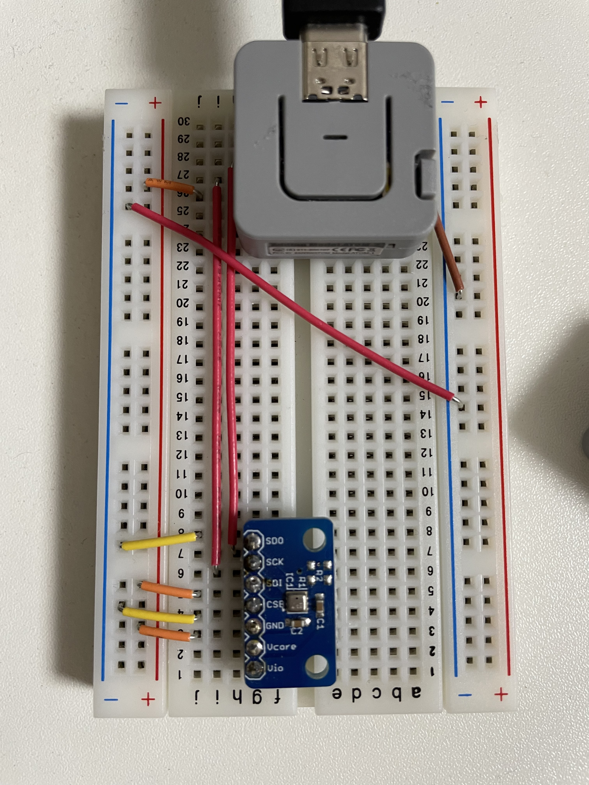

# bme280-exporter

M5Atom Lite で BME280 から取得した気温,湿度,気圧を（雑な） Prometheus 形式で出力する。

## 導入

- ボードマネージャから *esp32* を追加
  * `https://raw.githubusercontent.com/espressif/arduino-esp32/gh-pages/package_esp32_index.json` を*追加のボードマネージャのURL*として設定しておく
  * ボードは **M5Stack-ATOM** を選択
- [finitespace/BME280](https://github.com/finitespace/BME280) を導入
- `conf.hpp.sample` を `conf.hpp` にコピーして修正

## 出力例

```
# HELP temperature temperature by bme280
# TYPE temperature gauge
temperature 27.1100006104
# HELP humidity humidity by bme280
# TYPE humidity gauge
humidity 32.6728515625
# HELP pressure pressure by bme280
# TYPE pressure gauge
pressure 1025.4035644531
```

パスが `/metrics` であろうが、なかろうが同じ動作をする。メソッドに関しても同じ。

### 接続例

適当に繋いでいる。もしかしたら間違っているかも。


